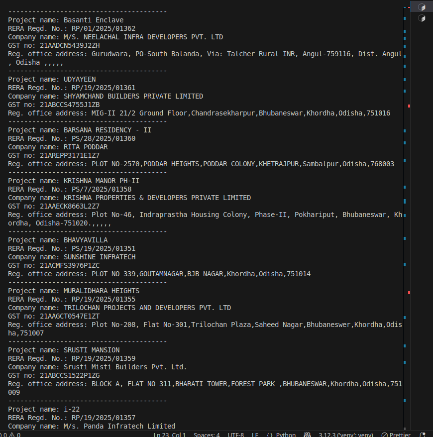

## Overview

The script is used to scrape `https://rera.odisha.gov.in/projects/project-list`. 
The site uses Angular JS, and is not static, therefore selenium web driver was
used to interact and use the provided JS load `html` into `app root`.


## Usage

```python

python3 scraper.py

```

## Libraries used

1. Selenium web driver
2. Beautiful Soup

## Challenges

For some of the projects, data appears out of order, so selecting by XPATH or CSS-SELECTOR is not useful. Instead use regex to get the label name and it's neighbour is the value.

## Output
